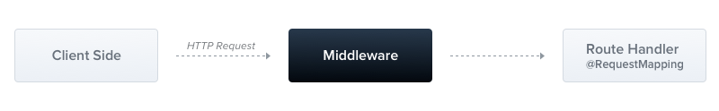
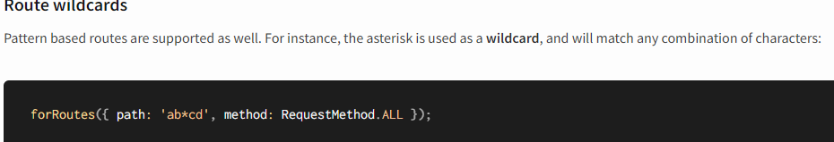
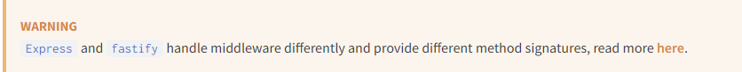

Middleware
=============
### 1. 미들웨어의 정의
Route Handler가 Client의 Request를 처리 되기 전에 수행되는 컴포넌트   


### 2. 미들웨어의 주요 역할
1. **코드 실행**
2. **Request 및 Response 객체 수정**
3. **Request 및 Response 주기 종료** 
4. **다음 Middleware 호출**
    + next()로 호출 스택상 다음 미들웨어 제어권을 전달
    + next()를 호출하지 않으면, 요청은 현재 미들웨어 함수에서 멈추게 되며, 다음 단계로 진행되지 않음
    + "Hanging" 상태는 Request-Response 주기가 완전히 종료되지 않고, 요청이 대기 상태로 남아 있는 것

### 3. 미들웨어 구현
+ 함수로 구현 (NestJS의 다른 기능과 통합 X)
```ts
import { Request, Response, NextFunction } from 'express';

export function logger(req: Request, res: Response, next: NextFunction) {
    console.log(`Request...`);
    next(); 
}
```

+ 클래스로 구현
  + NestMiddleware 인터페이스를 사용
    ```ts
    import { Injectable, NestMiddleware } from '@nestjs/common';
    import { NextFunction } from 'express';
    
    @Injectable()
    export class LoggerMiddleware implements NestMiddleware {
      use(req: Request, res: Response, next: NextFunction) {
        console.log('Received request', req);
        next();
      }
    }
    ```
    + Middleware 설정
        ```ts
        ...
        import { MiddlewareConsumer, Module } from '@nestjs/common';
        import { LoggerMiddleware } from './logger/logger.middleware';
    
        @Module({
          imports: [
            UsersModule,
            ConfigModule.forRoot({
              ...
            }),
            TypeOrmModule.forRoot({
              ...
            }),
          ],
          controllers: [],
          providers: [],
        })
        export class AppModule {
          configure(consumer: MiddlewareConsumer): any {
            consumer.apply(LoggerMiddleware).forRoutes('/users');
          }
        }
        ```   
        cf) route에 wild card 사용 가능   
        
      + NestMiddleware 인터페이스
        ```ts
        export interface NestMiddleware<TRequest = any, TResponse = any> {
          use(req: TRequest, res: TResponse, next: (error?: Error | any) => void): any;
        }
        ```
        + req와 res의 Type이 Request와 Response로 고정되어있지 않을까?
          * Express와 Fastify의 차이   
             
          Fastify는 Middleware를 플러그인 시스템으로 구현됨.   
          (참고: https://fastify.dev/docs/latest/Reference/Plugins/)   
          Fastify를 사용하는 경우, 미들웨어는 request와 reply 객체를 사용   
              ```ts
                import { Injectable, NestMiddleware } from '@nestjs/common';
                import { FastifyRequest, FastifyReply } from 'fastify';
            
                @Injectable()
                export class LoggerMiddleware implements NestMiddleware {
                  use(req: FastifyRequest['raw'], res: FastifyReply['raw'], next: () => void) {
                    console.log('Request...');
                    next();
                  }
                }
              ```
          * REST API가 아닌 GraphQL과 같은 것들도 처리 가능하도록...
          + MiddlewareConsumer
            + MiddlewareConsumer는 NestJS에서 미들웨어를 관리하기 위한 헬퍼 클래스
            + 여러 가지 내장 메서드를 제공하며, 이를 통해 미들웨어를 Fluent 방식으로 쉽게 관리   
              (참고: https://en.wikipedia.org/wiki/Fluent_interface)
            + middleware-consumer.interface.d.ts      
            ```ts
            export interface MiddlewareConsumer {
               apply(...middleware: (Type<any> | Function)[]): MiddlewareConfigProxy;
            }
            ```   
            ```ts
            export interface MiddlewareConfigProxy {
              /**
               * ...routes: (string | RouteInfo)[] -> 다중 url 또는 컨트롤러도 등록이 가능하다.
               */
              /**
              * exclude: 미들웨어를 적용하지 않는 경로
              **/
              exclude(...routes: (string | RouteInfo)[]): MiddlewareConfigProxy;
              forRoutes(...routes: (string | Type<any> | RouteInfo)[]): MiddlewareConsumer;
            }
            ```   
          + 전역으로 Middleware 적용하기   
            + 주의점: INestApplication 타입에 정의된 use는 클래스를 인수로 받을 수 없음   
            -> NestMiddleware 인터페이스가 아닌 function으로 작성해야함.
            ```ts
            import { NextFunction } from 'express';
          
            export function Logger4IdentifyMiddleware(
              req: Request,
              res: Response,
              next: NextFunction,
            ) {
              console.log(`===REQUEST ARRIVED ${Date.now()} ===`);
              next();
            }
            ```
            ```ts
            import { NestFactory } from '@nestjs/core';
              import { AppModule } from './app.module';
              import { ValidationPipe } from '@nestjs/common';
              import { Logger4IdentifyMiddleware } from './logger/logger4Identify.middleware';
              
              async function bootstrap() {
                const app = await NestFactory.create(AppModule);
                app.useGlobalPipes(
                  new ValidationPipe({
                    transform: true,
                  }),
                );
                app.use(Logger4IdentifyMiddleware);
                await app.listen(3000);
              }
              bootstrap();
            ```